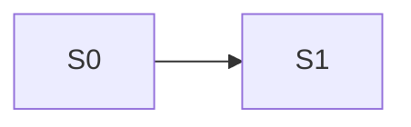

<!--
TEMPLATE — task map. Copy to <artefact_root>/<slug>/tasks/README.md, delete this header, fill it in.
Written at step A7 / B7.

THE STATUS TABLE IN §5 IS THE DECLARED RESUME POINT. On "continue", and after any context compaction, this
table is read FIRST — before memory, before the conversation, before anything else. It is the externalised
state machine that makes F9 (amnesia, premature termination) detectable.

S0 IS ALWAYS TYPES, SCHEMA AND THE DATA LAYER. Everything depends on it, and discovering that after three
surfaces are built costs a re-plan.

LAZY ELABORATION: full plans and test cases live in task_details.md for THE SECTION ABOUT TO RUN ONLY. Later
sections carry inventory and design references until their turn.

Sections are not deleted. Write None or Not applicable.
-->

# Tasks — <slug>

| | |
|---|---|
| Track | A / B / B-lite |
| Requirement | `../final_requirement.md` v<n> |
| Design | `../design/` — <n> documents |
| Final review | `../final-review-report.md` |
| Sections | S0–S<n> |
| **Currently elaborated** | S<n> only |
| Detail | `task_details.md` |

## 1. Sections

| Section | Owns | Requirements | Design | Discipline | Depends on |
|---------|------|--------------|--------|-----------|-----------|
| S0 | types, schema, data layer | | | database | — |
| S1 | | R<n> | `design-01` | | S0 |
| S<n> | **regression** *(Track B, mandatory)* | — | `../do-not-break.md` | | all |

Each section's task plan uses the matching discipline format from
[`task-formats/README.md`](task-formats/README.md) — path relative to `.ai/templates/`.

## 2. Dependency order

| Section | Cannot start until | Why |
|---------|-------------------|-----|
| | | |

Dependency diagrams are **inferred, not proven**. If a section turns out to depend on a later one, that
surfaces at execution and costs a re-plan of two sections — record it in the execution report's discoveries
when it happens.

## 3. Global rules for every section

Binding on all tasks. Stated once here rather than repeated per task.

| # | Rule |
|---|------|
| 1 | Re-pin the feature steering file, the relevant requirement `R`-block, and this section's design doc **before starting** |
| 2 | All four gates pass before the section is reported complete — real output, not a claim |
| 3 | Extract pure logic so it is testable without a store, a network, or a UI |
| 4 | **Non-destructive ordering** — the new path ships and is verified before the old one is touched |
| 5 | **Removals are recorded and deferred to cutover**, never executed inside a section |
| 6 | A section is not complete while any follow-up is open |
| 7 | Nothing on the do-not-regress register is reintroduced |
| 8 | 3× verification before reporting the section complete |
| 9 | A document found wrong is healed immediately, and the index updated |
| 10 | Every claim about existing code carries `path:line`, read and verified |

## 4. Ordering constraints

| Constraint | Why |
|------------|-----|
| Types and schema first | every other section imports them |
| New path before old path is touched | keeps a working state at every intermediate point |
| Regression section last | it verifies everything the other sections did |
| <project-specific constraint> | |

## 5. Status table 🔴

**The resume point.** Updated at every section boundary. Read first on "continue".

| Section | Status | Tasks done | Gates | Follow-ups open | Report | Updated |
|---------|--------|-----------|-------|-----------------|--------|---------|
| S0 | not started / **in progress** / complete / blocked | 0/<n> | — | 0 | | |
| S1 | not started | 0/<n> | — | 0 | | |

| Status | Means |
|--------|-------|
| not started | no work done |
| in progress | started, not all tasks done |
| **complete** | all tasks done · all four gates green · **zero open follow-ups** · execution report written |
| blocked | needs a decision or an unmet dependency — say which in the blockers table |

A section with an open follow-up is **not** complete, whatever else is true.

## 6. Blockers

| Section | Blocked by | Needs | Raised |
|---------|-----------|-------|--------|
| | | | |

## 7. Follow-ups

Every open follow-up, across sections. Cleared before the next section starts.

| # | From | Description | Severity | Status |
|---|------|-------------|----------|--------|
| 1 | S<n> task <n> | | 🔴 / 🟡 / 🟢 | open / done |

## 8. Deferred removals

Discovered during execution, executed **only** at cutover with individual approval.

| # | Thing | Found at | Why it can go | Consumers read? | Cutover row |
|---|-------|----------|---------------|-----------------|-------------|
| 1 | | S<n> | | ☐ | |

Nothing in this table is deleted before `cutover-report.md` exists and the user has approved that specific
item.

## 9. Traceability

| Requirement | Sections | Tasks | Verified in |
|-------------|----------|-------|-------------|
| R1 | S1 | T1.1, T1.2 | `execution-report-S1.md` |

| | |
|---|---|
| Requirements with no task | <list, or none — each is a gap> |
| Tasks tracing to no requirement | <list, or none — each is scope creep, **F2**> |

## 10. Close-out checklist

| # | Item | Done |
|---|------|------|
| 1 | Every section complete, zero open follow-ups | ☐ |
| 2 | All four gates green on the final state | ☐ |
| 3 | Every `do-not-break.md` row verified *(Track B)* | ☐ |
| 4 | `manual-testing.md` executed | ☐ |
| 5 | Cutover complete, or explicitly none needed | ☐ |
| 6 | Project docs synced | ☐ |
| 7 | Retrieval index rebuilt *(tier 2)* | ☐ |
| 8 | `INDEX.md` Zone 2 moved to shipped | ☐ |
| 9 | **Feature steering file deleted** | ☐ |
| 10 | 3× verification on the artefact set | ☐ |
